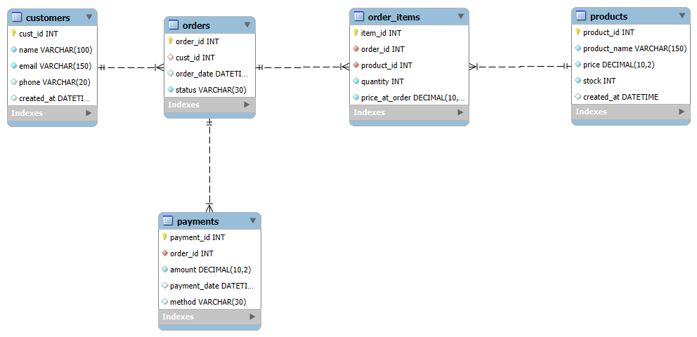

# E-Commerce Database Project

A beginner-friendly e-commerce database designed in MySQL.  
It demonstrates database design, SQL queries, views, procedures, and triggers.

## Features
- 5 main tables: Customers, Products, Orders, Order_Items, Payments
- ER Diagram included
- Sample data for testing
- Queries for sales reports and analytics
- Views for top customers
- Stored procedure for customer order history
- Trigger to reduce stock after order

## How to Run
1. Run `sql/schema.sql` to create the database and tables.
2. Run `sql/sample-data.sql` to insert sample records.
3. Explore `sql/queries.sql`, `sql/views.sql`, `sql/procedures.sql`, and `sql/triggers.sql`.

## ER Diagram
